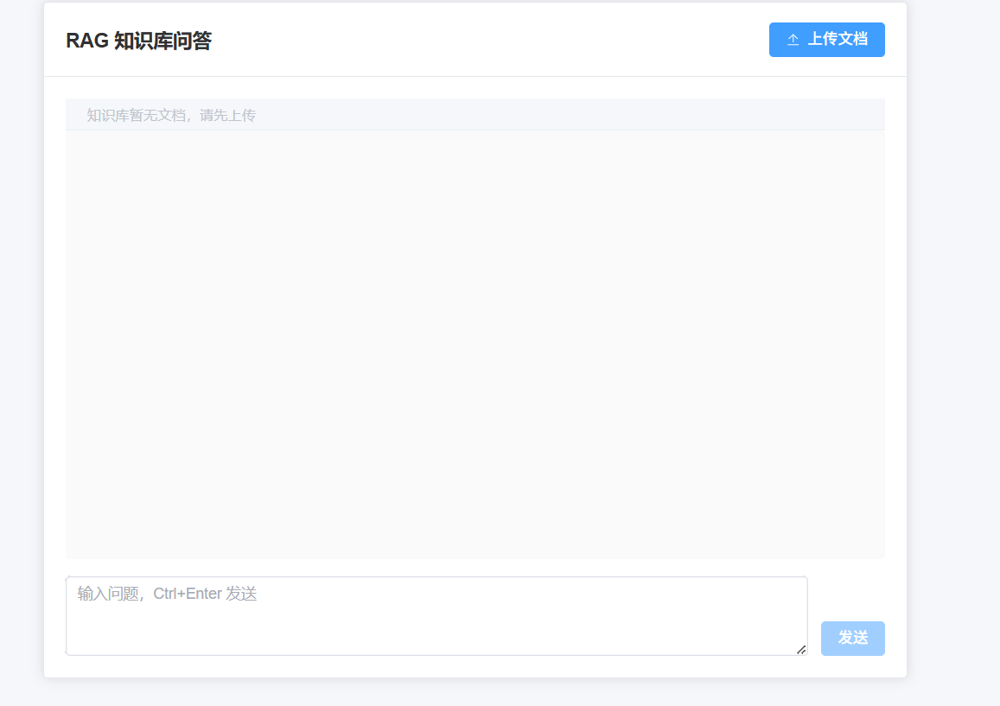
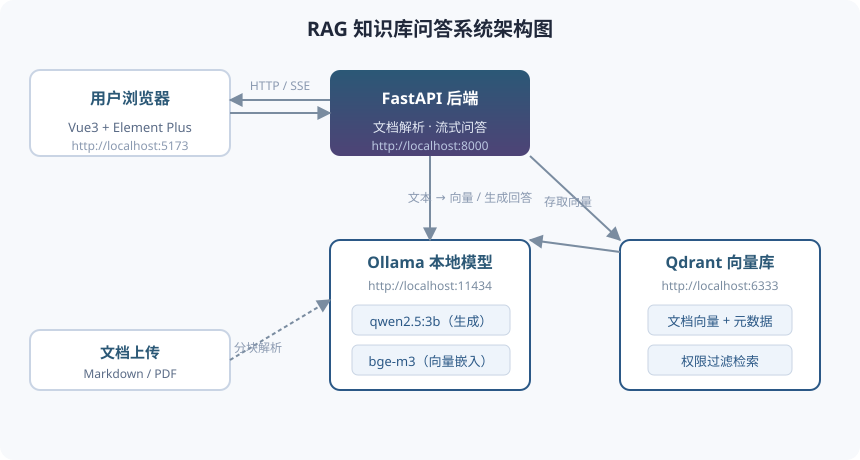

# RAG 知识库问答系统

基于 Vue3 + FastAPI + Ollama + Qdrant + MySQL 的本地 RAG 系统。

> **刚 clone 本项目？** 仓库不含模型和环境文件（约 20 GB），请先按 [SETUP.md](SETUP.md) 完成准备再启动。

## 界面预览





## 快速启动（Windows 原生模式）

无需 Docker，双击即可，一键启停：

| 操作 | 双击运行 |
| --- | --- |
| 一键启动全部服务 | `start_all.bat` |
| 一键停止全部服务 | `stop_all.bat` |

`start_all.bat` 会依次打开 5 个窗口，标题分别是 `RAG-MySQL` / `RAG-Ollama` / `RAG-Qdrant` / `RAG-Backend` / `RAG-Frontend`，
约 10 秒后访问 http://localhost:5173 。只关某一个窗口 = 只停该服务；`stop_all.bat` 会停掉全部服务并把这 5 个窗口关掉。

| 服务 | 地址 |
| --- | --- |
| 前端 | http://localhost:5173 |
| 后端 API 文档 | http://localhost:8000/docs |
| Qdrant 控制台 | http://localhost:6333/dashboard |
| Ollama | http://localhost:11434 |
| MySQL（用户账号库） | localhost:3306 |

### 启动脚本一览

| 脚本 | 作用 |
| --- | --- |
| `start_all.bat` | 一键启动下面 5 个服务 |
| `stop_all.bat` | 一键停止全部服务（按命令行匹配窗口 + 按端口兜底） |
| `start_mysql.bat` | 只启动 MySQL（3306） |
| `start_ollama.bat` | 只启动 Ollama（11434） |
| `start_qdrant.bat` | 只启动 Qdrant（6333 / 6334） |
| `start_backend.bat` | 只启动后端 API（8000） |
| `frontend\start.bat` | 只启动前端（5173） |

### 改 .bat 脚本必读的两个坑（都已踩过）

1. **换行必须是 CRLF**。LF-only 会让 cmd 解析多行 `for ( )` / `if ( )` 块时错乱，报 `'xxx' is not recognized`。
2. **脚本内容保持纯 ASCII**。若项目安装路径含中文：一旦把中文写进 .bat，双击时控制台以代码页 936 启动、
   脚本内又执行 `chcp 65001`，cmd 读文件就会字节错位，**静默破坏后面的行**（典型症状：`set NODE_HOME=...` 失效、
   Ollama/后端窗口一闪而过却没起来）。所以所有脚本都用 `%~dp0` 派生路径，不写任何中文字面量。
   > 同理，不要写 `start "标题" cmd /k "title 标题 && "%ROOT%脚本.bat""`：`%ROOT%` 展开会把中文注入到被解析的
   > 命令串里，一样会截断 `&&` 链。用最简单的 `start "标题" "%ROOT%脚本.bat"` 即可。

### 组件位置（都在本项目 tools 目录下，不占用 C 盘）

| 组件 | 路径 |
| --- | --- |
| Ollama | `tools\ollama\ollama.exe` |
| Ollama 模型数据 | `tools\ollama-data`（由环境变量 `OLLAMA_MODELS` 指定） |
| Qdrant | `tools\qdrant\qdrant.exe`，数据在 `tools\qdrant\storage` |
| 模型 GGUF 文件 | `tools\models\qwen2.5-3b`、`tools\models\bge-m3` |
| 后端虚拟环境 | `backend\.venv`（Python 3.13） |
| 便携版 Node 20 | `tools\node20\node-v20.18.0-win-x64` |
| MySQL 8（独立安装） | 如 `D:\MySQL\mysql-8.0.26-winx64`，存用户账号（登录功能），路径见 `start_mysql.bat` |

后端依赖安装：`pip install -r backend\requirements.txt`

### 模型导入

下载对应 GGUF 文件后（见 [SETUP.md](SETUP.md)），执行：

```bat
cd tools\models\bge-m3
ollama create bge-m3 -f Modelfile

cd tools\models\qwen2.5-3b
ollama create qwen2.5:3b -f Modelfile
```

> 本项目使用 qwen2.5:3b（生成）+ bge-m3（向量化），两者共约 2.8 GB 显存，4 GB 显存的显卡即可同时常驻。

> 注意：如需改用 qwen2.5-7b，它是多分片 GGUF（`-00001-of-00002` / `-00002-of-00002`）。Modelfile 中**必须为每个分片各写一行 `FROM`**，否则会报 `invalid split GGUF ... has 1 shards, expected 2` —— Ollama 0.34.4 不会自动加载同目录下的兄弟分片。

## 功能特性

- 用户注册 / 登录（JWT 鉴权，账号存 MySQL）
- 支持 Markdown、PDF 文档上传
- 文档级权限隔离（`access_level`：public / admin / private）
- 流式问答（SSE）
- 5人并发，超过排队
- 全程本地，零API成本

## 登录与部署

### 登录功能

打开 http://localhost:5173 后先注册一个账号，再登录进入问答页。上传文档和提问都会校验登录态（未登录返回 401 并跳回登录页）。
用户账号存储在本地 MySQL 的 `rag_kb` 库（首次启动后端时自动建 `users` 表）。

### 云端部署（阿里云 + DashScope）

本地模式用 Ollama 生成回答；上云时无需搬运 20 GB 模型，把 `.env` 里的 `LLM_PROVIDER` 改为 `dashscope` 并填上
`DASHSCOPE_API_KEY` 即可整体切换为通义千问 API：生成走 qwen-plus、向量化走 text-embedding-v3（维度 1024，与本地
bge-m3 对齐，代码零改动）。MySQL 可改用阿里云 RDS，在 `.env` 中修改 `MYSQL_HOST` 等配置即可。
